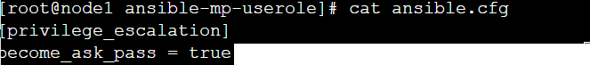
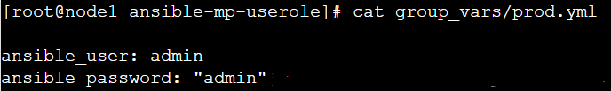
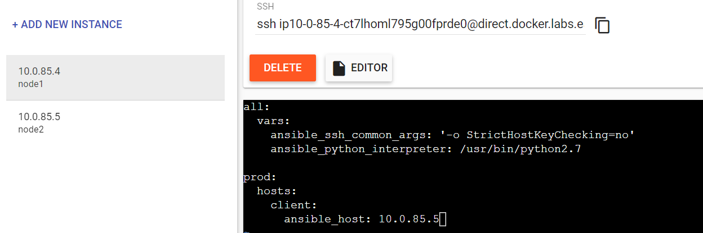
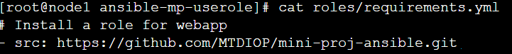
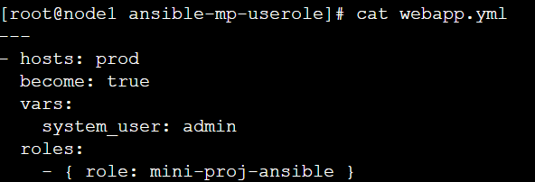
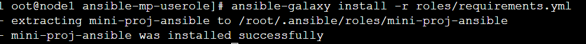
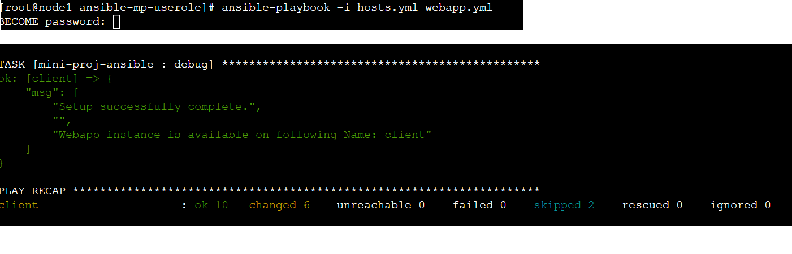
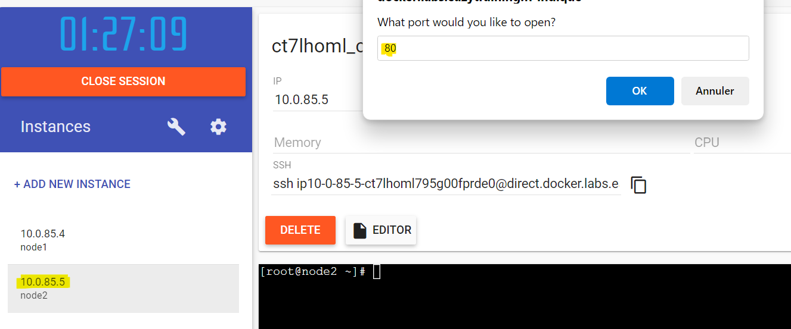
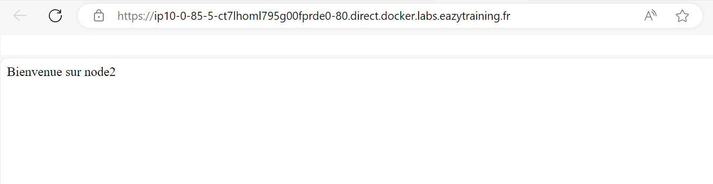

# mini-proj-ansible
Ansible Role: Containerized Webapp
=========

This Ansible playbook will Deploy & run Docker Compose project for Webapp instance.

webapp deployment on host machine using ansible playbook from https://github.com/MTDIOP/mini-proj-ansible .

To use it you first have to deploy an ansible machine with a host.

first install playbook from link given earlier : ansible-galaxy install -r roles/requirements.yml

run with command : ansible-playbook -i hosts.yml --ask-vault-password webapp.yml

Role Variables
=========

This role comes with following variables defined in defaults/main.yml:

```
system_user: admin
webapp_name: webapp
webapp_directory: /home/{{ system_user }}/index.html
webapp_port: 80
```
How to Use the Role
=========
1/Create file ansible.cfg



2/Create group_vars/prod;yml for creadentials files



3/Create hosts.yml file



4/Create roles/requirement.yml to declare src file



5/Create webapp.yml file to use the role



6/Install the role

ansible-galaxy install -r roles/requirements.yml



7/Deploy the webapp

ansible-playbook -i hosts.yml --ask-vault-password webapp.yml



8/Application Access



